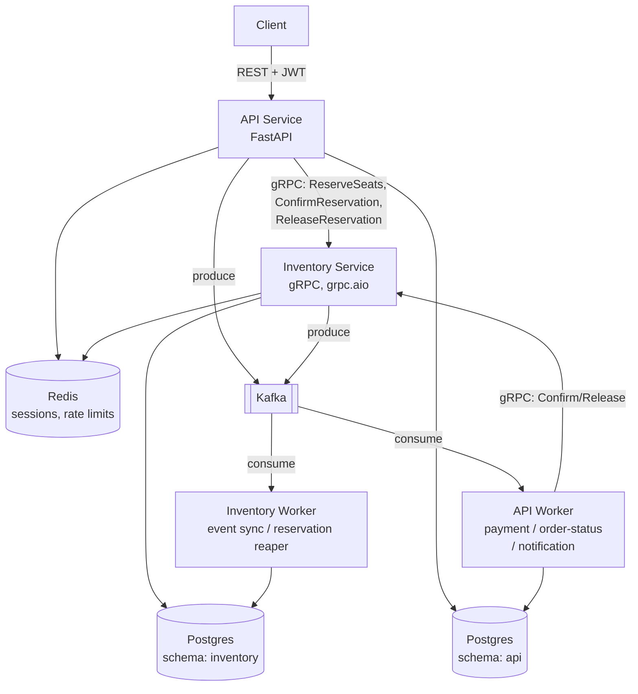
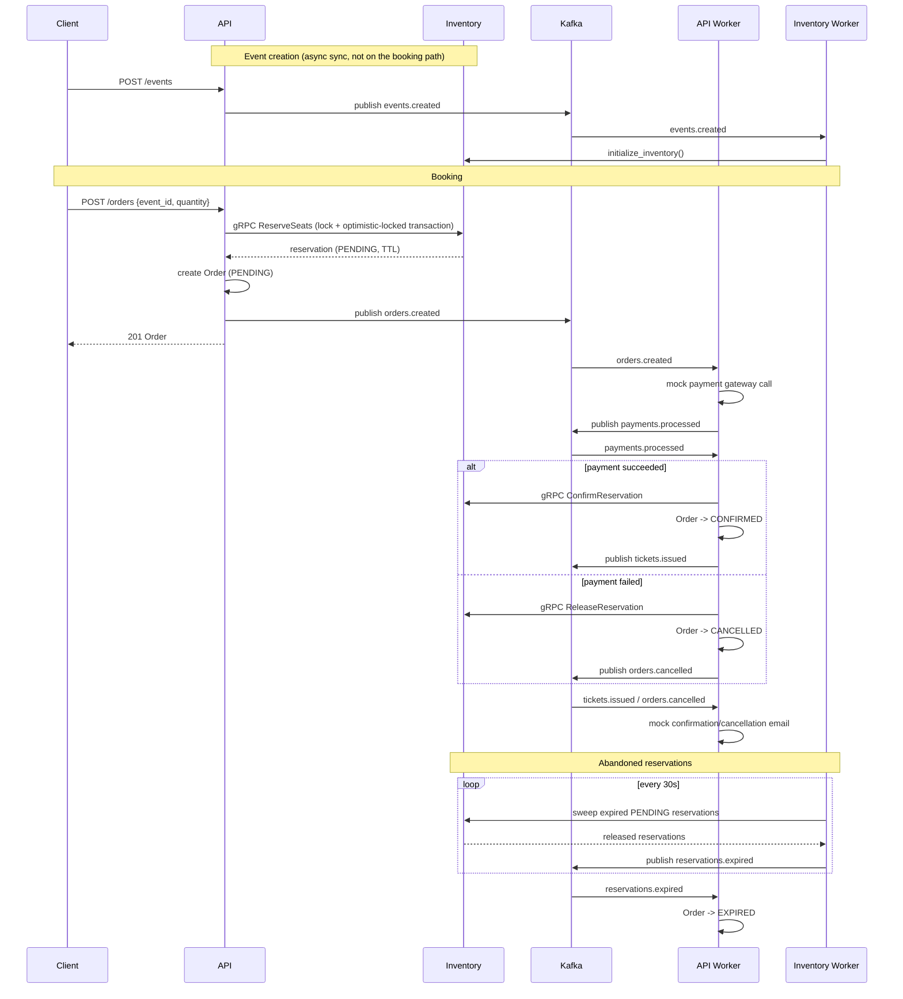

# EventSphere

[](https://github.com/OWNER/eventsphere/actions/workflows/ci.yml)
[](LICENSE)
[](https://www.python.org/downloads/)

A distributed event ticketing platform built as two microservices - a FastAPI REST API and a gRPC inventory service - coordinated over Kafka, with PostgreSQL and Redis as the data layer. The centerpiece is the concurrency control on ticket booking: it is tested, under real concurrent load, to never oversell an event's capacity.

## Contents

- [Architecture](#architecture)
- [Why these choices](#why-these-choices)
- [Concurrency control](#concurrency-control-how-overbooking-is-prevented)
- [Event-driven flows](#event-driven-flows)
- [Project structure](#project-structure)
- [Local development](#local-development)
- [Running the tests](#running-the-tests)
- [API documentation](#api-documentation)
- [Deployment: free tier (Oracle Cloud + Aiven)](#deployment-free-tier-oracle-cloud--aiven)
- [Deployment: Kubernetes and AWS](#deployment-kubernetes-and-aws)
- [Scalability notes](#scalability-notes)
- [Security notes](#security-notes)

## Architecture



**Two services, four processes.** `api` and `inventory` are the two microservices called for in the brief; `api-worker` and `inventory-worker` are the same codebases running in consumer mode (same Docker image, different container command - see `infra/docker-compose.yml`). That's a deliberate simplification over a third and fourth "real" microservice: the workers don't serve requests, so there's nothing gained from a separate deployable image, but they *are* scaled and deployed independently in Kubernetes (separate `Deployment`, no `Service`) if that boundary ever needs to become real.

**Data ownership.** Postgres is one physical instance locally, but two logical schemas: `api` owns `users`, `events`, `orders`; `inventory` owns `event_inventory`, `reservations`. There is no cross-schema foreign key - `orders.reservation_id` is a plain string, correlated to the Inventory service's own primary key, not a database-enforced relationship. That's the actual service boundary; the shared instance is a local/demo convenience, and [Scalability notes](#scalability-notes) covers what changes to split them onto separate RDS instances for real.

## Why these choices

| Choice | Reasoning |
|---|---|
| **FastAPI + gRPC**, not gRPC everywhere | The public API benefits from REST's ubiquity, OpenAPI docs, and browser-friendliness. The Inventory service is purely internal, high-frequency, and latency-sensitive - gRPC's binary framing and HTTP/2 multiplexing fit that better than JSON-over-REST would. |
| **aiokafka**, not confluent-kafka | Both were acceptable per the brief. aiokafka is asyncio-native, so producers and consumers share the same event loop as the rest of the app with no thread-pool bridging. confluent-kafka (wrapping librdkafka) is the higher-throughput, more battle-tested choice for very high message rates, at the cost of a C dependency and a sync-to-async bridge in an async codebase. For this system's actual throughput, aiokafka's simplicity wins. |
| **Optimistic locking + a Redis lock**, not pure pessimistic `SELECT FOR UPDATE` | See [Concurrency control](#concurrency-control-how-overbooking-is-prevented) - this is the one place this project's approach differs from this author's other (billing-focused) projects, which use pessimistic row locks for serialized single-writer invoice numbering. Ticket inventory has many concurrent writers per popular event rather than one serialized writer, which is a different contention shape. |
| **Integer cents for money**, not float or Decimal-from-JSON | Consistent with this author's other projects. Floats lose precision; Decimals round-trip awkwardly through JSON. An integer count of cents sidesteps both. |
| **One Alembic history, two schemas**, not one migration environment per service | The brief's folder structure specifies a single `migrations/` directory. A stricter microservices setup would give each service its own migration history against its own database - documented as the next step in [Scalability notes](#scalability-notes) rather than built here, since splitting it doesn't change anything about how the *code* is structured, only how it's deployed. |
| **Idempotency keys via a partial unique index**, not a separate idempotency-tracking table | `POST /orders` accepts an `Idempotency-Key` header; a partial unique index on `(user_id, idempotency_key) WHERE idempotency_key IS NOT NULL` means a retried request with the same key returns the original order instead of creating a duplicate. Same pattern this author uses for idempotent usage-ingestion in a separate billing-API project. |
| **eager_defaults on every model with a server-generated timestamp** | A real bug caught during testing (see below) - worth calling out because it's a genuine async-SQLAlchemy gotcha, not a stylistic choice. |
| **4 physical Kafka topics carrying 7 logical event types**, not one topic per event type | Originally one-per-fact (7 topics) for the usual reasons - scoped subscriptions, independent partition/retention tuning. Revised after a real external constraint: the free-tier deployment (below) caps a Kafka service at 5 topics. The fix decouples `EventType` (still all 7, still what every consumer dispatches on) from the physical `Topic` it's published to, so several event types can share one topic without any consumer losing the ability to tell them apart - see `services/shared/kafka/topics.py` and `WALKTHROUGH.md`'s Part 0 for the full mechanism. |

## Concurrency control: how overbooking is prevented

This is the question this project exists to answer well, since it's the canonical systems-design interview question for anything ticket/inventory-shaped.

**The mechanism, in order:**
1. A request to reserve seats first acquires a short-lived Redis lock scoped to that one event (`SET NX PX`, released via a compare-and-delete Lua script so a request never releases a lock it no longer owns). This is a **contention-reduction optimisation** - under normal load it means concurrent requests for the same popular event queue briefly instead of all racing the database at once.
2. Inside the lock, the actual reservation is a database transaction using SQLAlchemy's built-in **optimistic concurrency control**: `EventInventory` has a `version` column: every update includes `WHERE version = :expected_version`, and if another transaction won the race and moved the version first, SQLAlchemy raises `StaleDataError` and the operation retries from a fresh read (up to 5 times).

The version column is what actually *guarantees* correctness. The lock is what keeps that guarantee cheap under load - if the lock ever expired mid-operation (a slow query, a GC pause), the version check still catches the conflict; it would just mean more retries, not an overbook.

**This was tested against real infrastructure, not asserted.** The core test fires 50 concurrent 1-seat reservation attempts at an event with a capacity of 10 seats, against a real local Postgres and Redis (`tests/integration/test_inventory_concurrency.py::test_fifty_concurrent_reservations_never_oversell_ten_seats`):

```
successes=10  rejected=40  final.reserved_count=10  final.available=0
```

Exactly 10 succeed, exactly 40 are cleanly rejected with a `FAILED_PRECONDITION`/409, and the database's own count matches - not 9 (a lost update) and not 11 (an overbook). That run also surfaced a real design gap: under heavy-enough contention, some requests can exhaust their lock-wait budget entirely before ever reaching the database. The fix wasn't to hide that - it's a distinct `RESOURCE_EXHAUSTED` gRPC status (mapped to a retryable error client-side), because "the event is too hot right now, retry" is a genuinely different situation from "sold out" or "you lost a race."

## Event-driven flows



Booking itself only makes one synchronous call (the gRPC reservation) - everything after "Order created" is asynchronous. A booking that's reserved-but-never-paid (abandoned checkout, or a crash between the gRPC call succeeding and the Order row committing) isn't handled with a distributed transaction or a saga; it's handled by the reservation's own TTL and a periodic reaper that releases it and tells the API to mark the order `EXPIRED`. That trades a few minutes of held-but-abandoned inventory for not needing 2PC - a reasonable trade for a system where reservations are already meant to be short-lived.

## Project structure

```
eventsphere/
├── proto/inventory.proto        # gRPC contract
├── services/
│   ├── shared/                  # Base ORM class, generic repository, Kafka
│   │   │                        # topics/schemas/producer/consumer, errors,
│   │   │                        # pagination, logging - imported by both services
│   │   └── generated/           # gRPC stubs (committed; regenerate with
│   │                            # scripts/generate_proto.sh after editing the .proto)
│   ├── api/app/
│   │   ├── core/                 # config, JWT/bcrypt, rate limiting, request logging
│   │   ├── models/, schemas/, repositories/, services/
│   │   ├── grpc_client/          # Inventory client wrapper
│   │   ├── api/v1/               # auth, events, orders, health routers
│   │   └── workers/              # payment / order-status / notification consumers
│   └── inventory/app/
│       ├── core/, models.py, repositories/, services/
│       ├── grpc_handlers/        # the gRPC servicer
│       └── workers/              # event-sync consumer, reservation reaper
├── migrations/                   # Alembic (single history, two schemas)
├── infra/
│   ├── docker-compose.yml        # local dev: self-hosted Postgres/Redis/Kafka
│   ├── docker-compose.prod.yml   # free-tier deploy: Kafka is external (Aiven); no insecure defaults
│   ├── Dockerfile.api, Dockerfile.inventory
│   ├── postgres/init.sql, kafka/create_topics.sh
│   └── kubernetes/                # namespace, configmap, secret, api.yaml,
│                                   # inventory.yaml, *-worker.yaml, ingress.yaml
├── tests/
│   ├── unit/, integration/, contract/
│   └── conftest.py
└── .github/workflows/ci.yml, cd.yml
```

## Local development

**Requirements:** Docker and Docker Compose.

```bash
git clone <this-repo> && cd eventsphere
cp .env.example .env          # defaults work as-is for local compose

make up                        # docker compose up --build
```

This brings up Postgres, Redis, Zookeeper+Kafka, a one-shot topic-creation container, a one-shot migration runner, both services, and both workers. The API is at `http://localhost:8000` (interactive docs at `/docs`), the Inventory service's gRPC port is `50051` (reachable with `grpcurl -plaintext localhost:50051 list` - server reflection is enabled).

```bash
make down                      # stop everything and remove volumes
docker compose -f infra/docker-compose.yml --profile tools up   # + Kafka UI (:8080) and pgAdmin (:5050)
```

To run a service directly on the host instead of in Docker (e.g. for a debugger), install `requirements-dev.txt` into a virtualenv, point `.env` at `localhost` for every service, and run `uvicorn services.api.app.main:app --reload` or `python -m services.inventory.app.main`.

## Running the tests

```bash
pip install -r requirements-dev.txt
# needs a local Postgres + Redis reachable at the URLs in tests/conftest.py
# (defaults: localhost:5432/eventsphere_test, localhost:6379/1) -
# `docker compose -f infra/docker-compose.yml up postgres redis -d` is enough
pytest -v --cov=services
```

All 28 tests pass against real infrastructure - this was actually run, not assumed:

```
28 passed in 8.14s
```

- **`tests/unit/`** - password hashing, JWT round-tripping, Kafka event-envelope serialization. No external services.
- **`tests/integration/`** - the concurrency test described above, the inventory reserve/confirm/release lifecycle, and the full API booking flow (register → login → RBAC'd event creation → book → idempotent retry → cancel → order history) against a real Postgres, a real Redis, and a real in-process gRPC server. Kafka is faked with an in-memory recorder rather than a live broker - the fake also relays `events.created`/`events.updated` straight to the Inventory client, standing in for what the real `event_sync_consumer` would do, so the tests exercise the same contract without needing a broker running.
- **`tests/contract/`** - the gRPC service's wire contract (status codes, message shapes, and a guard against silently dropping an RPC from the `.proto`) and the OpenAPI schema's shape (paths, auth scheme, response fields).

The Alembic migration itself was also verified end-to-end against a real, empty Postgres database: `alembic upgrade head` from nothing, confirm all 5 tables exist in the right schemas, `alembic downgrade base`, confirm they're gone, `alembic upgrade head` again.

## API documentation

FastAPI generates OpenAPI/Swagger docs automatically: `/docs` (Swagger UI, with a working "Authorize" button - `/auth/login` uses the OAuth2 password flow specifically so this works out of the box) and `/redoc`. The raw schema is at `/openapi.json`.

All routes are versioned under `/api/v1`.

| Method | Path | Auth | Notes |
|---|---|---|---|
| POST | `/api/v1/auth/register` | – | |
| POST | `/api/v1/auth/login` | – | OAuth2 password flow |
| POST | `/api/v1/auth/refresh` | – | rotates the refresh token |
| POST | `/api/v1/auth/logout` | – | revokes the refresh token in Redis |
| GET | `/api/v1/events` | – | search/filter/paginate |
| GET | `/api/v1/events/{id}` | – | |
| POST | `/api/v1/events` | organizer/admin | |
| PATCH / DELETE | `/api/v1/events/{id}` | owning organizer/admin | |
| POST | `/api/v1/orders` | any user | `Idempotency-Key` header optional |
| GET | `/api/v1/orders`, `/api/v1/orders/{id}` | any user | own orders only |
| POST | `/api/v1/orders/{id}/cancel` | any user | own orders only |
| GET | `/api/v1/health`, `/api/v1/health/ready` | – | liveness / readiness |

## Deployment: free tier (Oracle Cloud + Aiven)

A live, indefinitely-free deployment doesn't require the AWS/Kubernetes
stack below. This project runs as-is on:

- **Compute**: an Oracle Cloud "Always Free" VM (`VM.Standard.A1.Flex`,
  2 OCPU/12GB - not a trial; free for as long as the tier exists), running
  `infra/docker-compose.prod.yml`.
- **Postgres and Redis**: self-hosted in that same compose stack - no
  free-tier constraint makes this worth outsourcing.
- **Kafka**: **not** self-hosted here. [Aiven's free Kafka
  tier](https://aiven.io/free-kafka) is a genuinely permanent free plan
  (no credit card, no trial expiry), capped at 5 topics - which is why
  this system runs on 4 physical topics carrying 7 logical event types
  rather than one topic per event type (see [Why these
  choices](#why-these-choices) and `services/shared/kafka/topics.py`).
  `docker-compose.prod.yml` has no Kafka/Zookeeper services at all;
  `KAFKA_SECURITY_PROTOCOL=SASL_SSL` plus three `KAFKA_SASL_*` env vars
  connect the same producer/consumer code to Aiven's broker instead.

```bash
git clone <this-repo> && cd eventsphere
cp .env.example .env
# fill in: JWT_SECRET_KEY (openssl rand -hex 32), POSTGRES_PASSWORD,
# and the four KAFKA_* values from your Aiven console
export $(grep -v '^#' .env | xargs)
docker compose -f infra/docker-compose.prod.yml --env-file .env up --build -d
```

Only port 8000 needs to be reachable from the internet - Postgres, Redis,
and the Inventory service's gRPC port are deliberately not exposed, even
on the host, in this compose file (unlike the local dev one, which
exposes them for convenience). An optional [Cloudflare
Tunnel](https://developers.cloudflare.com/cloudflare-one/connections/connect-networks/)
gets a real `https://` hostname instead of a bare IP, free, with no
port-forwarding.

## Deployment: Kubernetes and AWS

The manifests in `infra/kubernetes/` target **EKS**, assuming managed data stores rather than running Postgres/Kafka in-cluster:

| Local (docker-compose) | Production (AWS) |
|---|---|
| `postgres` container | **RDS for PostgreSQL** (Multi-AZ) |
| `redis` container | **ElastiCache for Redis** |
| `zookeeper` + `kafka` containers | **MSK** (or self-managed Kafka on EC2/EKS) |
| `api` / `inventory` Deployments | unchanged - these run in-cluster either way |
| `ConfigMap` / `Secret` | `Secret` is a **template only** - swap for **External Secrets Operator** reading AWS Secrets Manager, or Sealed Secrets, before this touches anything real |
| `ingress.yaml` | provisions a real **ALB** via the AWS Load Balancer Controller |

```bash
kubectl apply -f infra/kubernetes/namespace.yaml
kubectl apply -f infra/kubernetes/configmap.yaml     # edit the placeholder endpoints first
kubectl apply -f infra/kubernetes/secret.yaml        # replace with real secret management first - see the file's own warning
kubectl apply -f infra/kubernetes/api.yaml infra/kubernetes/api-worker.yaml
kubectl apply -f infra/kubernetes/inventory.yaml infra/kubernetes/inventory-worker.yaml
kubectl apply -f infra/kubernetes/ingress.yaml
```

CI/CD (`.github/workflows/`): `ci.yml` lints, checks the committed gRPC stubs haven't drifted from `proto/inventory.proto`, and runs the full test suite against real Postgres/Redis service containers on every PR. `cd.yml` builds multi-arch (`amd64`/`arm64`) images and pushes them to GHCR on merge to `main`; the deploy step is gated behind a `DEPLOY_ENABLED` repo variable so the workflow stays green in a fork with no cluster to deploy to.

The Inventory Deployment uses Kubernetes' native gRPC probe type (`readinessProbe.grpc`, stable since 1.24) against the standard `grpc.health.v1.Health` service the server already registers - no sidecar or exec-probe binary needed.

## Scalability notes

- **Read-heavy event browsing**: `GET /events` is offset/limit paginated today; past a few hundred thousand rows, `OFFSET` itself becomes the bottleneck. Keyset (cursor) pagination on `(starts_at, id)` is the natural next step and doesn't change the API shape much (`page` becomes an opaque cursor token).
- **Database split**: the two logical schemas in one Postgres instance are a local/demo simplification. Splitting them onto separate RDS instances is mechanical - each service already only ever queries its own schema, and there's no cross-schema foreign key to untangle - but it does mean giving each service its own Alembic migration history rather than the one shared here.
- **Worker scaling**: `api-worker`/`inventory-worker` are scaled on CPU/memory in the sample HPA-free Deployments here; a real deployment would scale them on **consumer-group lag** instead (e.g. via KEDA watching Kafka), since "am I keeping up with the topic" is the metric that actually matters for a consumer, and CPU usage on an I/O-bound consumer is a weak proxy for that.
- **Hot-event contention**: the Redis lock is a single-node `SET NX/PX`, sufficient for cutting down wasted retries under this system's expected load. A deployment specifically worried about the lock itself being a correctness-critical single point of failure (rather than a performance optimisation backed by the DB's version column, as it is here) would run Redlock across an odd number of independent Redis nodes instead.
- **Kafka throughput**: aiokafka was chosen for simplicity (see [Why these choices](#why-these-choices)); a system needing meaningfully higher message throughput than this one would swap to confluent-kafka/librdkafka, which is a producer/consumer-layer change, not an architectural one.

## Security notes

- No secrets are hardcoded anywhere in the codebase - every credential is read from environment variables (see `.env.example`), and `infra/kubernetes/secret.yaml` is explicitly a template with placeholder values, not something meant to be applied as-is.
- Passwords are hashed with bcrypt; JWTs are signed (HS256) with a secret that must be overridden via `JWT_SECRET_KEY` - the default in `.env.example` is intentionally obviously-a-placeholder.
- Refresh tokens are tracked in Redis by their `jti` claim, so logout (and, if needed, forced revocation) actually invalidates them, rather than relying on a stateless JWT's expiry alone.
- Every request body is validated by Pydantic before it reaches business logic; SQL is parameterized throughout via SQLAlchemy's query builder (no raw string interpolation into queries anywhere in the codebase).
- The Redis-backed rate limiter is a fixed-window counter (60 req/min per client IP by default) - see the code comment in `services/api/app/core/rate_limit.py` for the trade-off against a sliding window.
- Kubernetes container `securityContext`s run as a non-root user with `allowPrivilegeEscalation: false` and a read-only root filesystem.

---
